# Kira Organelle Pipeline (Stage Placement)

## Stage Order

1. Discover tool contracts (`summary.json`, `pipeline_step.json`, `primary_metrics` path).
2. Ingest per-cell TSV from upstream tools into `CellsState`.
3. Run **Global Robust Normalization** on merged per-cell metrics.
4. Compute systems composites (StressVector, CompensationDeficit, CPI, AFS, IMSC, RegimeClass).
5. Compute Stage-3 population topology analytics:
   - cluster robust summaries (median/p10/p90/mad)
   - tail enrichment and heterogeneity index
   - Mahalanobis rare-state detection
   - regime entropy / global distribution statistics
6. Compute Stage-4 fragility/sensitivity analytics:
   - finite-difference CPI sensitivity in Z-space
   - per-cell dominant fragility axis
   - cluster/global axis fragility rankings
7. Compute Stage-6 systems landscape modeling:
   - potential, stability gradient, basin detection, transition candidates
8. In multi-sample integration mode, compute Stage-7 cross-sample mapping:
   - pooled harmonized z-space
   - regime JS divergence matrix
   - basin overlap matrix
   - DSP vectors and SDI matrix
9. Compute Stage-8 therapeutic projection:
   - AVS, TOI, CRI, CSP, TPS-based ranking
10. Compute Stage-9 dynamic stability modeling:
   - LSI, basin ARS, perturbation trajectory projection, BEE, SCI_system
11. Compute Stage-10 formal systems model export (optional):
   - DSG, ODE proxy, STM, basin connectivity map
12. Compute Stage-11 validation and biological-grounding diagnostics:
   - invariants, robustness envelope, covariance diagnostics, biological constraints
13. Compute stress-localization and other downstream aggregate artifacts.
14. Write `state.json`, `cells.json`, and `integration/*` outputs.

## 11-Stage Deterministic Flow

```mermaid
flowchart LR
  A["Stage 1: Ingestion and Contracts"] --> B["Stage 2: Global Robust Normalization"]
  B --> C["Stage 3: Systems Composites"]
  C --> D["Stage 4: Topology and Rare-State"]
  D --> E["Stage 5: Fragility and Output Hardening"]
  E --> F["Stage 6: Systems Landscape Modeling"]
  F --> G["Stage 7: Cross-Sample Alignment and Comparative Mapping"]
  G --> H["Stage 8: Therapeutic Projection and Axis Vulnerability"]
  H --> I["Stage 9: Dynamic Stability Modeling"]
  I --> J["Stage 10: Formal Systems Model Export"]
  J --> K["Stage 11: Validation and Biological Grounding"]
```

## Global Normalization Stage

- Placement: immediately after TSV ingestion and before aggregation/output.
- Method: per-metric robust location/scale (`median`, `MAD`, `scale=1.4826*MAD`).
- Determinism:
  - fixed metric iteration order from registry
  - deterministic median selection via in-place selection utility
  - deterministic tie-breaking and sorted per-metric summary output
- Missingness/NaN:
  - non-finite values are treated as missing
  - normalization keeps missing as `NaN`
  - unreliable metrics (`n_valid < MIN_VALID_CELLS`) produce `NaN` z-scores
  - degenerate scale (`MAD == 0`) produces zero z-scores for finite inputs
